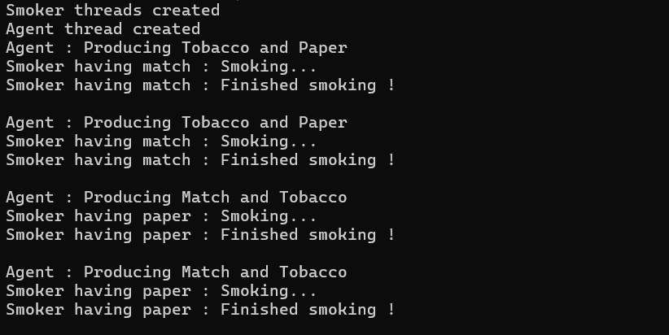

# 🚬 Cigarette Smokers Problem – C Solution

This repository provides multiple implementations of the classic **Cigarette Smokers Problem**, a synchronization scenario in operating systems. Implementations are available in both **C** and **C++** using **POSIX threads**, **semaphores**, **monitors**, and **bitmasking** techniques.

## 🔧 Problem Statement
- An agent places **two random ingredients** on a table (chosen from tobacco, paper, and match).
- Three smokers, each possessing **one unique ingredient**, attempt to complete their cigarette.
- The smoker with the missing third item picks up the other two, smokes, and notifies the agent.
- The process repeats, modeling **inter-process communication** and **synchronization**.

---

## 🧩 Understanding the Solution Approach

The **Cigarette Smokers Problem** is a classic **producer-consumer** synchronization problem that emphasizes inter-thread communication, resource sharing, and mutual exclusion.

### Key Roles:

- **Agent (Producer):**
  - Randomly selects **two** out of the three ingredients and places them on the table.
  - Notifies smokers that ingredients are available.
  - Waits until a smoker finishes before placing new ingredients.

- **Smokers (Consumers):**
  - Each smoker has **one unique ingredient**.
  - If the other two ingredients are on the table, that smoker:
    - Picks them up,
    - Smokes,
    - Notifies the agent.

### Common Challenges:

- Ensuring **mutual exclusion** on accessing shared resources (like the table).
- Avoiding **race conditions** where multiple smokers try to smoke at once.
- Coordinating **agent** and **smokers** using synchronization primitives so that:
  - The agent doesn't place new items until a smoker is done.
  - Only the correct smoker reacts based on the combination of ingredients.

### Solution Techniques:

1. **Semaphore-Based Approach:**
   - Uses binary semaphores to control access between the agent and smokers.
   - Separate semaphores per smoker to wake only the correct thread.
   - Agent posts to smoker’s semaphore based on the selected ingredients.

2. **Monitor Approach (Mutex + Condition Variables):**
   - Uses mutexes for mutual exclusion and condition variables for signaling.
   - Each smoker thread waits on its own condition variable.
   - The agent signals the right smoker after placing ingredients.

3. **Bitmasking Approach:**
   - Represents ingredients as bits (e.g., tobacco = 1, paper = 2, match = 4).
   - Table state is represented as a combination of bits.
   - Efficient checking of which smoker should proceed using bitwise logic.

These solutions demonstrate synchronization techniques and how they help in managing **critical sections**, **signaling**, and **resource availability** in concurrent programming.

---

## 📁 Project Structure

cigarette_smoker_problem/

├── semaphore_solution.c                  # C solution using binary semaphores

├── monitor_solution.c                    # C monitor-based solution using mutexes & condition variables

├── standard_bitmasking_solution.c        # Bitmask approach in C

└── README.md                             # Documentation file

## 🚀 How to Compile and Run
> 🐧 For **Linux / WSL users**

### Prerequisites

> sudo apt update

> sudo apt install build-essential

### Compilation Commands

## C solutions
gcc semaphore_solution.c -o semaphore_solution -pthread

gcc monitor_solution.c -o monitor_solution -pthread

gcc standard_bitmasking_solution.c -o standard_bitmasking_solution -pthread

### Run

./semaphore_solution

./monitor_solution

./standard_bitmasking_solution

Use \`Ctrl + C\` to terminate, as these simulate infinite smoker-agent interactions.

## 🧠 Concepts Demonstrated
- 🧵 POSIX Threads (\`pthread\`)
- 🔁 Semaphores (\`sem_t\`)
- 🔒 Mutex Locks & Condition Variables
- 🎯 Bitmasking for State Tracking
- ⚙️ Resource Synchronization in Multithreaded Systems

## 📷 Terminal Preview

A sample run showing how the agent and smokers interact:

## 👨‍💻 Author
**Kunal Purohit**  
Made with ❤️ for operating systems enthusiasts

## 🌐 Connect

  
  

> Feel free to fork or star 🌟 the repo if you found this helpful!

